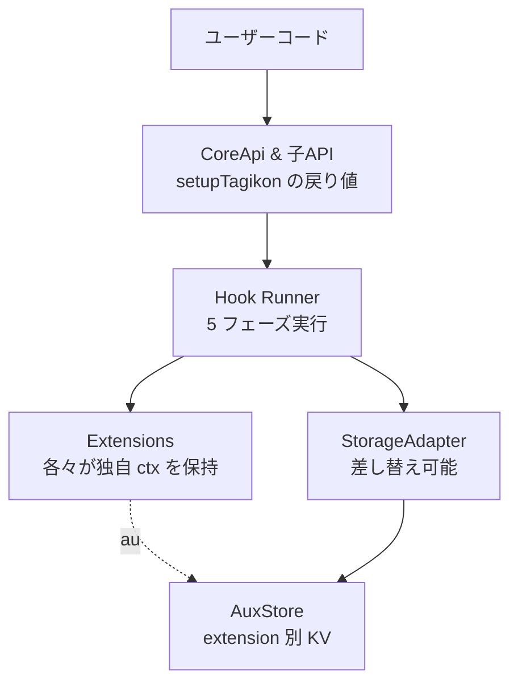
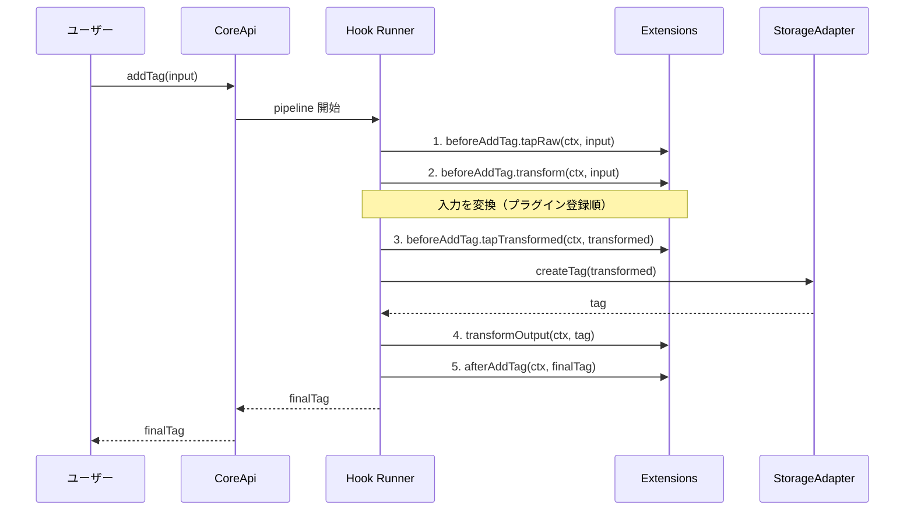

# アーキテクチャ概要

Tagikon はオブジェクトをタグベースで管理する TypeScript ライブラリ。コアは「タグの CRUD」と「タグ ↔ オブジェクト関係の操作」のみを提供し、**タグの属性・階層・論理削除・ID 戦略・ストレージ等は全てプラグインで提供する**。

## レイヤー構造

## オペレーションのライフサイクル

各 CoreApi 操作は以下5フェーズの Hook を順に実行する。`addTag` を例にしたシーケンス:

詳細は [packages/core/docs/arch/hook-lifecycle.md](../../packages/core/docs/arch/hook-lifecycle.md) を参照（フェーズ5b で作成予定）。

## プラグイン3種

| 種別             | 役割                                                       |
| ---------------- | ---------------------------------------------------------- |
| `IdProvider`     | タグID生成 + シリアライズ/デシリアライズ                   |
| `StorageAdapter` | タグ・関係・AuxStore の永続化                              |
| `Extension`      | フック処理・カスタム API・Tag への属性追加（TagImplement） |

詳しくは [plugin-system.md](plugin-system.md) を参照。

## モノレポ構成

| パッケージ                               | 役割                                                   |
| ---------------------------------------- | ------------------------------------------------------ |
| `@tagikon/core`                          | コア API・Hook Runner・クエリ言語・型定義              |
| `@tagikon/utils`                         | 汎用ユーティリティ（memoize・safeJsonParse・Set 演算） |
| `@tagikon/id-provider-string`            | 文字列 ID プロバイダー                                 |
| `@tagikon/id-provider-uuid`              | UUID ID プロバイダー                                   |
| `@tagikon/storage-adapter-in-memory-map` | インメモリ参照実装                                     |
| `@tagikon/storage-adapter-drizzle`       | Drizzle ORM 経由の SQLite/PostgreSQL アダプター        |
| `@tagikon/extension-soft-delete`         | 論理削除タグ                                           |
| `@tagikon/extension-default-attributes`  | addTag 時の属性デフォルト補完                          |
| `@tagikon/extension-hierarchy`           | タグ階層（ツリー）                                     |
| `@tagikon/codec-effect-schema`           | Effect Schema からの TagPropertyCodec ブリッジ         |

各パッケージの詳細は `packages/<pkg>/docs/arch/overview.md`（フェーズ5で作成）を参照。

## 関連ドキュメント

- [plugin-system.md](plugin-system.md) — プラグイン3種の責務と相互作用
- [security.md](security.md) — Permission・隔離設計
- [../contributing/tech-stack.md](../contributing/tech-stack.md) — 技術スタックと TS 設定の制約
