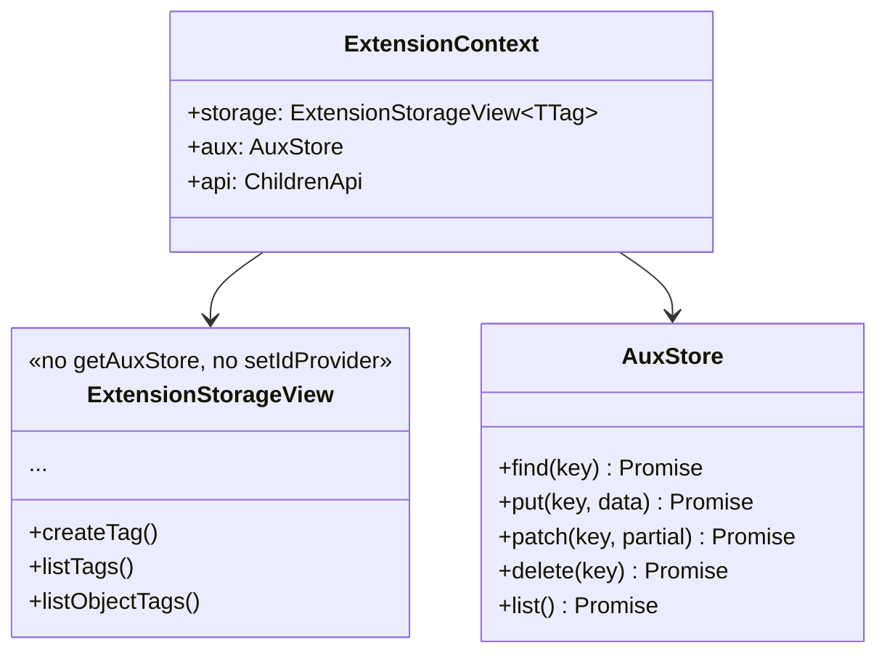

# プラグインシステム

Tagikon のすべての拡張機能は `IdProvider` / `StorageAdapter` / `Extension` の3責務に整理されている。コアは最小の `Tag<TId>`（`id` のみ）を提供し、その他の振る舞いはすべてプラグインに委譲する。

## 3種のプラグイン

| 種別             | 主な責務                                                                                                                           |
| ---------------- | ---------------------------------------------------------------------------------------------------------------------------------- |
| `IdProvider`     | タグ ID の生成・シリアライズ・デシリアライズ。`TagPropertyCodec<TId, string>` を継承し、保存先が常に `string` であることを型で保証 |
| `StorageAdapter` | タグの CRUD・タグ↔オブジェクト関係・`findObjects` / `countObjects` 実装・extension 別 `AuxStore` の払い出し                        |
| `Extension`      | 5 フェーズのフック処理・カスタム API の登録・`Tag` への属性 intersection（TagImplement 用途）                                      |

## TagImplement: コア Tag の拡張

`Tag<TId>` は `id` のみを持つ最小エンティティ。`name` / `kind` / `description` 等は利用者が intersection で追加する。

```typescript
interface Tag<TId = unknown> {
	readonly id: TId;
}

type MyTag = Tag<TagId> & {
	readonly name: string;
	readonly description: string;
};

const tagikon = setupTagikon<MyTag>({
	/* ... */
});
```

`TTag extends Tag` のジェネリクスにより、`StorageAdapter` / `CoreApi` 全体に拡張型が伝播する。

## ExtensionContext

各 Extension は `ctx` を介して以下にアクセスする。`ctx` は `Object.freeze()` 済みで書き換え不可:



- **`ctx.storage`** — Permission に基づき制限された `StorageAdapter` の proxy view。`getAuxStore` / `setIdProvider` 等のアダプター内部 API は隠蔽される
- **`ctx.aux`** — この Extension 専用の `AuxStore`（`extensionId` symbol で隔離）
- **`ctx.api[CHILD_NS]`** — 子 Extension のカスタム API（同じく private スコープ）

## カスタム API のネスト

Extension は子 Extension をネストして登録できる。子 API は親の `ctx.api[CHILD_NS]` 経由でのみ参照可能で、外部からは親の namespace を介してのみアクセスできる。Public 登録された Extension は自身の `AuxStore` を `api` 経由で公開できるが、ネスト下の Extension は親からしか触れない。

## 属性の隔離

タグ自体（`id`・存在・公開属性）は全 Extension で共有される。一方で **「タグに紐づく追加属性」だけ** は各 Extension の `AuxStore` 内に隔離される:

| データ                                     | 共有 / 隔離              |
| ------------------------------------------ | ------------------------ |
| `Tag.id` / 公開属性                        | 共有                     |
| Extension が AuxStore で管理する追加データ | 隔離（extensionId 単位） |

## 関連ドキュメント

- [security.md](security.md) — Permission マニフェスト・実行時ガード
- [overview.md](overview.md) — 全体アーキテクチャ
- 個別の Extension 仕様は `packages/extension-*/docs/arch/overview.md`（フェーズ5b で作成）
