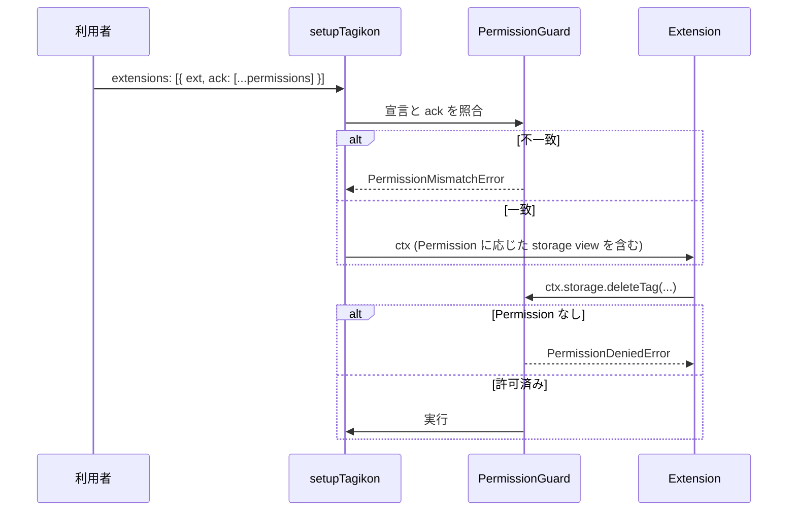

# セキュリティ設計

Tagikon は3rd-party Extension の実行を想定し、以下の方針でセキュリティを担保する。

## 設計原則

| 原則             | 実装                                                            |
| ---------------- | --------------------------------------------------------------- |
| 最小権限         | `PermissionManifest` で各 Extension が必要な権限を宣言          |
| 実行時ガード     | `ctx.storage` が Permission に基づく proxy view として制限      |
| ORM 非露出       | `ctx` には ORM オブジェクトを直接持たせない                     |
| 不変コンテキスト | `ctx` は `Object.freeze()` 済み                                 |
| 属性隔離         | Extension の追加データは `AuxStore`（`extensionId` 単位で隔離） |
| タイムアウト     | Extension ごとに上限を設定。利用者が引き上げ可能                |

## Permission マニフェスト

Extension は登録時に必要な Permission を宣言する。利用者は `setupTagikon` 時にこれを **acknowledge** する必要があり、宣言と acknowledgement が一致しない場合は `PermissionMismatchError` がスローされる。



### エラー階層

```
ExtensionError
  ├── PermissionMismatchError    宣言と ack が不一致
  ├── PermissionDeniedError      実行時に未承認の操作を試行
  └── IllegalExtensionDefinitionError
      └── NamespaceNotFoundError api を持つが namespace 未指定
```

詳しくは [packages/core/docs/arch/errors.md](../../packages/core/docs/arch/errors.md)（フェーズ5a で作成）を参照。

## ExtensionStorageView による隔離

`ctx.storage` は `StorageAdapter` をそのまま渡すのではなく、以下の操作を**物理的に隠蔽**した proxy:

- `getAuxStore(...)` — 他 Extension の AuxStore を直接覗く経路を遮断
- `setIdProvider(...)` / `setTagCodec(...)` — アダプター設定を変更する経路を遮断（`StorageAdapterSetup` / `StorageAdapter` のライフサイクル分離により実現）

これにより、Extension は他 Extension の隠蔽された属性を読み書きできず、アダプター設定を改変することもできない。

## AuxStore の隔離

各 Extension は `setupTagikon` 起動時に `extensionId`（`symbol`）に紐づいた `AuxStore` を一つ受け取る。`AuxStore` は単純な KV ストアだが、`extensionId` がアクセス鍵となるため別 Extension は触れない。

Public 登録された Extension は自身の `AuxStore` API を `ctx.api` 経由で外部公開できる（例: `extension-soft-delete` の `markDeleted`）。ネスト下の子 Extension の AuxStore は親 Extension からのみアクセス可能。

## タイムアウト

Extension の Hook 実行にはデフォルトでタイムアウトが設定される。利用者は Extension 単位で上限を引き上げ可能（DoS リスクとのトレードオフ）。

## 関連ドキュメント

- [plugin-system.md](plugin-system.md) — Extension の責務と context
- [overview.md](overview.md) — 全体アーキテクチャ
