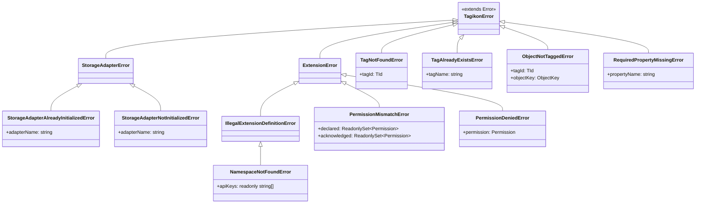

# エラー階層

すべてのライブラリ由来エラーは `TagikonError` を継承する。`instanceof TagikonError` でライブラリ起源か判定可能。

## 階層図

## 一覧

| エラー                                  | 親                                | 投げる場面                                         |
| --------------------------------------- | --------------------------------- | -------------------------------------------------- |
| `TagikonError`                          | `Error`                           | 全エラーの基底                                     |
| `ExtensionError`                        | `TagikonError`                    | Extension 関連エラーの基底                         |
| `StorageAdapterError`                   | `TagikonError`                    | StorageAdapter 関連エラーの基底                    |
| `TagNotFoundError<TId>`                 | `TagikonError`                    | 存在しない `tagId` を参照                          |
| `TagAlreadyExistsError`                 | `TagikonError`                    | 同名のタグが既に存在する場合（適用は実装依存）     |
| `ObjectNotTaggedError<TId>`             | `TagikonError`                    | オブジェクトに当該タグが付いていない場合           |
| `RequiredPropertyMissingError`          | `TagikonError`                    | `addTag` で必須プロパティが transform 後にも欠落   |
| `StorageAdapterAlreadyInitializedError` | `StorageAdapterError`             | `initialize` を二度呼んだ                          |
| `StorageAdapterNotInitializedError`     | `StorageAdapterError`             | `initialize` 前にデータ操作を呼んだ                |
| `IllegalExtensionDefinitionError`       | `ExtensionError`                  | Extension 定義不正の基底                           |
| `NamespaceNotFoundError`                | `IllegalExtensionDefinitionError` | api を持つが namespace 未指定                      |
| `PermissionMismatchError`               | `ExtensionError`                  | 宣言と acknowledgement が不一致                    |
| `PermissionDeniedError`                 | `ExtensionError`                  | Permission のない操作を `ctx.storage` 経由で呼んだ |

`HierarchyCycleError` 等のプラグイン固有エラーは各プラグインパッケージ側で `TagikonError` を継承する。

## 関連ドキュメント

- [../../../../docs/arch/security.md](../../../../docs/arch/security.md) — Permission 周りのエラー意味論
- [storage-adapter.md](storage-adapter.md) — Adapter ライフサイクル違反
