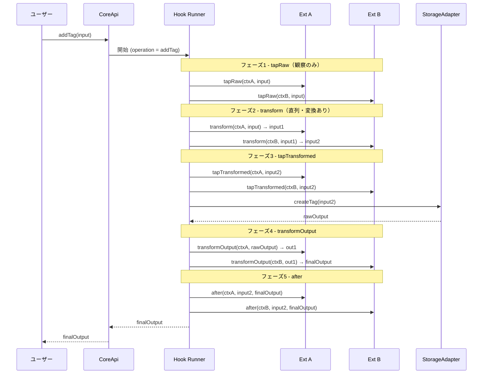

# フックライフサイクル

各 CoreApi 操作は5フェーズの Hook を経由する。Extension はこのフックを介してオペレーションに介入する。

## 5 フェーズ

`addTag` を例にした各フェーズ:

| フェーズ | フック名                      | 役割                                               |
| -------- | ----------------------------- | -------------------------------------------------- |
| 1        | `beforeAddTag.tapRaw`         | 入力をそのまま観察（変更不可）                     |
| 2        | `beforeAddTag.transform`      | 入力を変換（プラグイン登録順に実行）               |
| 3        | `beforeAddTag.tapTransformed` | 変換後の入力を観察                                 |
| 4        | `transformOutput`             | ストレージ操作の結果を変換（出力フィルタリング等） |
| 5        | `afterAddTag`                 | 最終結果を観察                                     |

すべての fn は第1引数に `ctx`（`ExtensionContext`）を取る。

## 型シグネチャ

```typescript
type TapRawFn<TCtx, TInput> = (ctx: TCtx, input: Readonly<TInput>) => void | Promise<void>;
type TransformFn<TCtx, TInput, TTransformed = TInput> = (
	ctx: TCtx,
	input: TInput,
) => TTransformed | Promise<TTransformed>;
type TapTransformedFn<TCtx, TTransformed> = (
	ctx: TCtx,
	input: Readonly<TTransformed>,
) => void | Promise<void>;
type TransformOutputFn<TCtx, TOutput> = (ctx: TCtx, output: TOutput) => TOutput | Promise<TOutput>;
type AfterFn<TCtx, TTransformed, TOutput> = (
	ctx: TCtx,
	input: Readonly<TTransformed>,
	output: TOutput,
) => void | Promise<void>;

interface HookPhases<TCtx, TInput, TOutput, TTransformed = TInput> {
	tapRaw?: TapRawFn<TCtx, TInput>;
	transform?: TransformFn<TCtx, TInput, TTransformed>;
	tapTransformed?: TapTransformedFn<TCtx, TTransformed>;
	transformOutput?: TransformOutputFn<TCtx, TOutput>;
	after?: AfterFn<TCtx, TTransformed, TOutput>;
}
```

各 Extension は1オペレーションにつき各フェーズ最大1関数を提供できる。`TTransformed` のデフォルトは `TInput` で、型を変換する場合のみ明示する。

## 実行フロー



## オペレーションごとの入力型

各オペレーションは独自の入力型を持つ。代表例:

| オペレーション  | 入力型                     |
| --------------- | -------------------------- |
| `addTag`        | `AddTagInput<TTag>`        |
| `editTag`       | `EditTagInput<TTag>`       |
| `deleteTag`     | `RemoveTagInput<TTag>`     |
| `tagObjects`    | `TagObjectsInput<TTag>`    |
| `untagObjects`  | `UntagObjectsInput<TTag>`  |
| `resetWithTags` | `ResetWithTagsInput<TTag>` |
| `findObjects`   | `FindObjectsInput<TTag>`   |
| `countObjects`  | `CountObjectsInput<TTag>`  |
| `listTags`      | `ListTagsInput`            |

詳細は [`packages/core/src/plugin/extension/types.ts`](../../src/plugin/extension/types.ts) を参照。

## 設計原則

- **`ctx` は `Object.freeze` 済み** — Extension が他 Extension のコンテキストを書き換えることはできない
- **transform は登録順に直列実行** — 並列実行ではなく、前段の出力が後段の入力になる
- **tap 系は観察のみ** — `Readonly<TInput>` で型レベルでも変更不可
- **`after` は副作用観察** — エラーは伝播するがフロー制御には使わない

## 関連ドキュメント

- [api.md](api.md) — 各 API の概要
- [overview.md](overview.md) — Core パッケージ概要
- [../../../../docs/arch/plugin-system.md](../../../../docs/arch/plugin-system.md) — Extension の責務全体像
