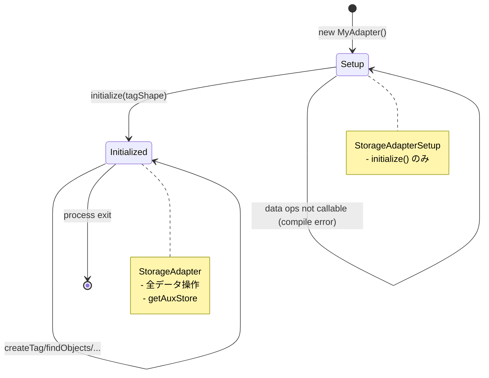

# StorageAdapter インターフェース

タグ・タグ ↔ オブジェクト関係・extension 別 AuxStore の永続化を担う。コアからは差し替え可能で、SQL DB（Drizzle）・インメモリ Map など実装が複数存在する。

## ライフサイクル

`StorageAdapterSetup<TTag>`（初期化前）→ `StorageAdapter<TTag>`（初期化後）の2段階。型レベルで分離されているため、初期化前にデータ操作を呼ぶと**コンパイルエラー**になる。



`initialize` を二度呼ぶと `StorageAdapterAlreadyInitializedError`。`initialize` 前にデータ操作（adapter 内部から呼ばれる場合）は `StorageAdapterNotInitializedError`。

## インターフェース

```typescript
interface StorageAdapterSetup<TTag extends Tag = Tag> {
	initialize(tagShape: TagShape<TTag>): StorageAdapter<TTag>;
}

interface StorageAdapter<TTag extends Tag = Tag> {
	// タグ CRUD
	createTag(data: Omit<TTag, "id">): Promise<TTag>;
	getTag(id: IdOf<TTag>): Promise<null | TTag>;
	listTags(): Promise<TTag[]>;
	updateTag(id: IdOf<TTag>, patch: Partial<Omit<TTag, "id">>): Promise<TTag>;
	deleteTag(id: IdOf<TTag>): Promise<boolean>; // true = 削除した / false = 存在しなかった

	// タグ ↔ オブジェクト関係
	addRelations(tagId: IdOf<TTag>, objectKeys: readonly ObjectKey[]): Promise<void>;
	removeRelations(tagId: IdOf<TTag>, objectKeys: readonly ObjectKey[]): Promise<void>;
	listObjectTags(objectKey: ObjectKey): Promise<IdOf<TTag>[]>;
	listTagObjects(tagId: IdOf<TTag>): Promise<ObjectKey[]>;

	// クエリ（lexicographic ソート）
	findObjects(query: ObjectQuery<IdOf<TTag>>, options?: FindObjectsOptions): Promise<ObjectKey[]>;
	countObjects(query: ObjectQuery<IdOf<TTag>>): Promise<number>;

	// Extension 別 KV ストア
	getAuxStore<TData = unknown>(
		extensionId: symbol,
		auxCodec?: AuxCodec<TData>,
	): AuxStore<IdOf<TTag>, TData>;
}

interface AuxStore<TKey, TData> {
	find(key: TKey): Promise<null | TData>;
	put(key: TKey, data: TData): Promise<void>;
	patch(key: TKey, partial: Partial<TData>): Promise<null | TData>;
	delete(key: TKey): Promise<boolean>;
	list(): Promise<[TKey, TData][]>;
}
```

## 設計上の決定事項

- **`name` はコアに含めない**。利用者が `Tag` を `TagWithName` 等で intersection 拡張して使う
- **`TId` は独立した型パラメータとせず `IdOf<TTag>` を使う**（常に等価のため）
- **`setupTagikon` が `tagShape.id` を `initialize` 経由で adapter に渡す**。アダプターのコンストラクタに `IdProvider` を渡さない
- **タグ自体（id・存在・公開属性）は全 Extension で共有**。`addTag` / `deleteTag` / `updateTag` は皆が観測可能
- **「タグに紐づく追加属性」だけ** が Extension ごとに `AuxStore` 内で隔離される
- **`ExtensionContext.storage` は `getAuxStore` を見せない proxy view**（`ExtensionStorageView<TTag>`）。これにより Extension が他 Extension の AuxStore を直接覗いたり、アダプター設定を変更する経路を物理的に塞ぐ

## 実装責務

`findObjects` / `countObjects` は必須実装。SQL 等にコンパイルできない adapter は core の `evaluateObjectQueryInMemory` / `countObjectQueryInMemory` に delegate する（`storage-adapter-in-memory-map` がこの形）。

`getAuxStore(extensionId)` は同じ `extensionId` symbol で複数回呼んでも同一の `AuxStore` インスタンスを返すこと。`auxCodec` を渡すと adapter がそれを使ってシリアライズする（省略時は JSON、`@tagikon/utils` の `safeJsonParse` でプロトタイプ汚染防御）。

## コントラクトテスト

`@tagikon/core/testing` から `runStorageAdapterTests` を import すると、CRUD・リレーション・AuxStore・findObjects/countObjects・各 TagSelector / ObjectQuery 組み合わせの共通テストスイートを実行できる。新規 Adapter 実装は必ず通すこと。

```typescript
import { runStorageAdapterTests } from "@tagikon/core/testing";

suite("MyAdapter", () => {
	runStorageAdapterTests({ createAdapter: () => new MyAdapter() });
});
```

詳細は [`testing.ts`](../../src/plugin/storage-adapter/testing.ts)。

## 関連ドキュメント

- [overview.md](overview.md) — Core 概要
- [query-language.md](query-language.md) — `findObjects` のクエリ仕様
- [errors.md](errors.md) — ライフサイクル違反エラー
- [../../../storage-adapter-in-memory-map/](../../../storage-adapter-in-memory-map/) / [../../../storage-adapter-drizzle/](../../../storage-adapter-drizzle/) — 実装例
