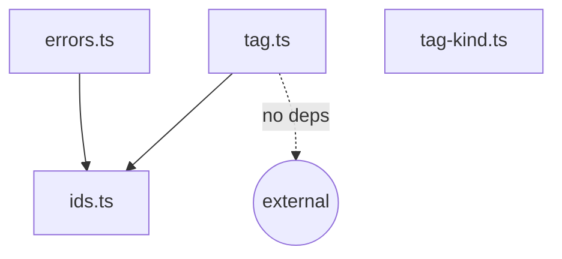

# `core/src/core`

ライブラリのコアエンティティとエラー定義。ここに依存しないコアモジュールはない（最下層）。

## 責務

- `Tag<TId>`・`IdOf<TTag>` の最小エンティティ
- `ObjectKey` などの branded type と factory
- `TagikonError` 階層

## ファイル一覧

| ファイル                   | 役割                                                               |
| -------------------------- | ------------------------------------------------------------------ |
| [tag.ts](tag.ts)           | `Tag<TId>` インターフェース + `IdOf<TTag>` ユーティリティ          |
| [tag-kind.ts](tag-kind.ts) | `TAG_KIND` 定数 + `TagKind` 型（コア非公開・プラグイン向け）       |
| [ids.ts](ids.ts)           | `ObjectKey` branded type + `objectKey()` factory                   |
| [errors.ts](errors.ts)     | `TagikonError` 階層（[errors.md](../../docs/arch/errors.md) 参照） |

## 依存関係

他のすべてのコアモジュールがここに依存する。逆向きの import は禁止。

## 関連ドキュメント

- [../../docs/arch/entities.md](../../docs/arch/entities.md)
- [../../docs/arch/errors.md](../../docs/arch/errors.md)
