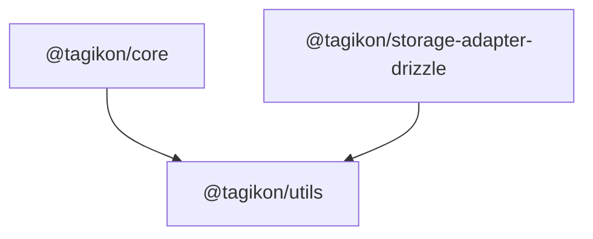

# `utils/src`

ライブラリ固有でない汎用 TypeScript ユーティリティを置く。JavaScript/TypeScript 製ソフトウェアであれば広く適用できる処理のみを対象とし、Tagikon 固有のロジックは含めない。

## 責務

- 引数なし関数の結果を一度だけ計算してキャッシュするメモ化
- プロトタイプ汚染を防ぐ安全な JSON パーサー（`__proto__` などの危険キーを再帰的に除去）
- `Set` の積集合・和集合演算

## ファイル一覧

| ファイル                     | 役割                                                                        |
| ---------------------------- | --------------------------------------------------------------------------- |
| [index.ts](index.ts)         | 公開エントリーポイント（re-export のみ）                                    |
| [memoize.ts](memoize.ts)     | `memoize` — 引数なし関数の遅延評価＆キャッシュ                              |
| [safe-json.ts](safe-json.ts) | `safeJsonParse` / `safeJsonParseValue` — プロトタイプ汚染対策 JSON パーサー |
| [set.ts](set.ts)             | `intersectSets` / `unionSets` — `Set` 積集合・和集合                        |

## 依存関係

依存なし（標準 JavaScript API のみ使用）。`@tagikon/core` や `@tagikon/storage-adapter-drizzle` がこのパッケージに依存する。

